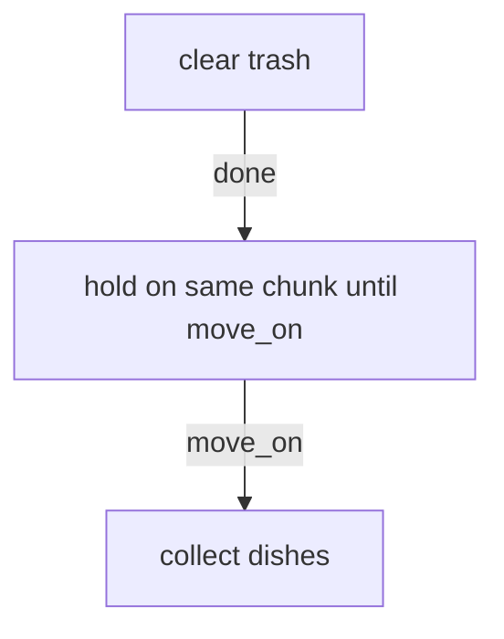
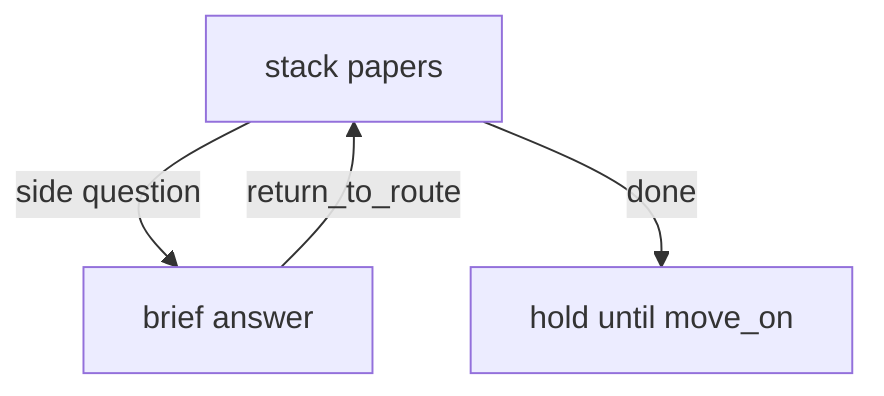
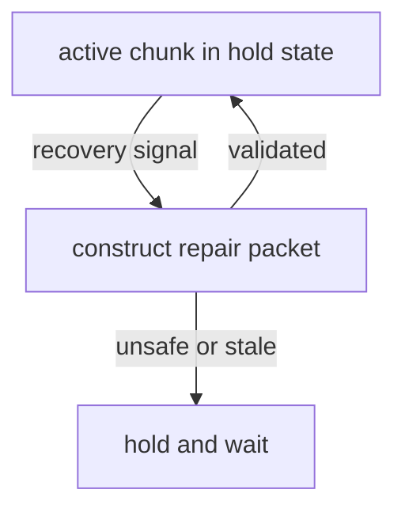

# Orion TTD Mermaid Planning Rule V0

Status: Milestone 5 design artifact  
Scope: planning language and compile rule

## Purpose

Mermaid is the planning language that turns Billy's plain-language need into a bounded route shape before implementation.

Mermaid is design input, not implementation by itself.

## Mermaid-first rule

Before new route logic or workflow fixtures are added:

1. reduce Billy's need to a small Mermaid flow
2. identify one active path
3. mark guards, recovery branches, and finish conditions
4. compile that flow into route state, packets, fixtures, and metrics

The harness should never jump directly from vague need to runtime behavior without this reduction step.

## Conversion path

Billy need becomes:

- Mermaid route
- `route_id`
- ordered states/chunks
- signals
- guards
- actions
- packet fields
- recovery paths
- workflow tests
- metrics tags

## Minimal compile table

Mermaid element → harness artifact

- node label → `active_chunk_label`
- node ID → `active_chunk_id`
- start node → initial `phase` and `chunk_index`
- conditional edge → guard
- side branch → parked branch or recovery branch
- end node → terminal route completion condition
- note/annotation → cadence, constraint, or safety gate

## Hook map from Orion source context

Need compiler hooks:

- broad need → small runnable route
- conflicting constraints → one forced-choice clarification
- emotional friction → humane cadence downshift

Protocol hooks:

- route shape → `TTD_COMMAND_V1`
- legal edges → allowed intents and reducer transitions
- completion nodes → completion conditions

Recovery hooks:

- interruption branch → side-question return
- drift branch → repair packet
- signal branch → recovery event that reanchors but does not auto-commit

Metrics hooks:

- guarded edges → invariant assertions
- failure-prone branches → fail/recover row coverage
- cadence annotations → smartness budget tag

## Example: done vs move_on

Meaning:

- `done` marks `clear trash` complete
- `done` does not activate `collect dishes`
- `move_on` advances exactly one chunk
- after `move_on`, the assistant must name `collect dishes`

## Example: side-question return

Meaning:

- a side question is a temporary branch
- answering it does not replace the route
- the route restores `stack papers` as the active chunk afterward

## Example: recovery signal branch

Meaning:

- recovery signal is a surface event only
- packet construction can re-anchor state
- signal itself never commits new progress

## Mermaid authoring constraints

- prefer 3-7 active chunks
- cap branching unless a branch is necessary for guard or recovery
- express constraints as guards when they are not observable actions
- every loop needs an exit or hold condition
- every route needs a terminal state

## Compile outputs that must exist

A Mermaid route is not ready until it can generate:

- one `route_id`
- one state template
- one allowed-intent set
- one command packet shape
- one happy-path fixture
- one interruption or repair fixture
- one metrics coverage mapping

## Practical role in Milestone 5

For this repo, Mermaid now serves as the upstream design surface for:

- command protocol
- reducer guard design
- smartness budget assignment
- workflow fixture generation
- fail/recover map coverage planning
