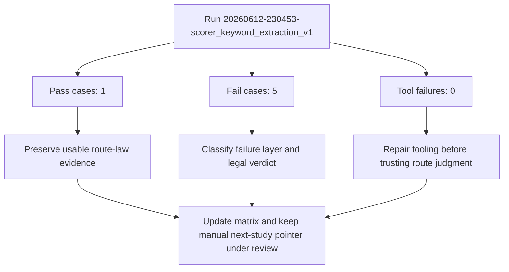

# Casework Review: scorer_keyword_extraction_v1

- **Run ID**: `20260612-230453-scorer_keyword_extraction_v1`
- **Imported At**: 2026-06-13T03:05:09.778Z
- **Raw Result JSON**: `study/raw/2026-06-12/scorer_keyword_extraction_v1__20260612-230453-scorer_keyword_extraction_v1.json`
- **Case Count**: 6

## Reflection Checklist
- [x] Mermaid-first review generated
- [x] Most important pass identified: Human-readable chunk label (PASS_CANDIDATE)
- [x] Most important failure identified: Exact canonical chunk id (FAIL_LOST_ROUTE)
- [x] Tool vs scorer vs language vs transport layer summarized deterministically
- [x] Evidence usability noted: This run is usable evidence because it contains both successful and disputed/failing boundaries.
- [x] Study status change remains gated by reflection and matrix review
- [ ] Human review may still refine the generated interpretation

## Mermaid-first Review

## Classification Summary
- **FAIL_LOST_ROUTE**: 5
- **PASS_CANDIDATE**: 1

## Key Findings
- Most important pass: Human-readable chunk label (PASS_CANDIDATE).
- Most important failure: Exact canonical chunk id (FAIL_LOST_ROUTE).
- Evidence usability: This run is usable evidence because it contains both successful and disputed/failing boundaries.

## Layer Classification
- Tool: No dominant tool failure pattern was recorded in this run.
- Scorer: Mixed pass/fail evidence suggests at least one scorer or interpretation boundary is disputed.
- Language: Route-law failure labels appeared in 5 case(s).
- Transport: Transport was not the dominant issue in this run.

## Legal-system Interpretation
- Committed state is law.
- Logs and visible DOM text are admissible evidence.
- Assistant prose is a claim, not state.
- If evidence is ambiguous, HOLD and choose the smallest legal reduction.
- PASS/FAIL describes route survival, not wording perfection.

## Next Study Implication
Keep the manual next-study pointer unchanged until the reflection loop and legal matrix settle the pass/fail dispute.

## Artifact Paths
- Raw evidence: `study/raw/2026-06-12/scorer_keyword_extraction_v1__20260612-230453-scorer_keyword_extraction_v1.json`
- Review: `study/reviews/2026-06-12/scorer_keyword_extraction_v1__20260612-230453-scorer_keyword_extraction_v1.md`
- Reflection loop: `study/CASEWORK_REFLECTION_LOOP_V1.md`
- Case-law matrix: `study/case-law/CASEWORK_CASE_LAW_MATRIX_V1.md`

> Note: Human/LLM review may refine the language lesson. Update the classification in the index if the heuristic/scorer was wrong.