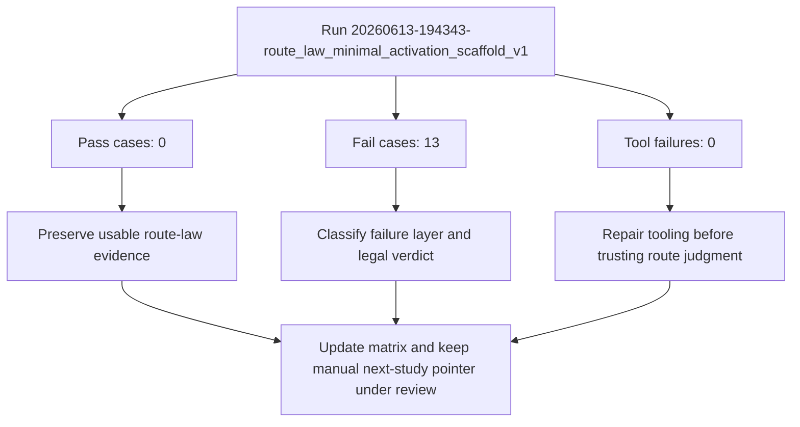

# Casework Review: route_law_minimal_activation_scaffold_v1

- **Run ID**: `20260613-194343-route_law_minimal_activation_scaffold_v1`
- **Imported At**: 2026-06-14T00:02:06.357Z
- **Raw Result JSON**: `study/raw/2026-06-13/route_law_minimal_activation_scaffold_v1__20260613-194343-route_law_minimal_activation_scaffold_v1.json`
- **Case Count**: 15

## Reflection Checklist
- [x] Mermaid-first review generated
- [x] Most important pass identified: no pass case recorded
- [x] Most important failure identified: Early active-only baseline (FAIL_LOST_ROUTE)
- [x] Tool vs scorer vs language vs transport layer summarized deterministically
- [x] Evidence usability noted: This run is usable evidence because it records route-law failure or scorer-dispute behavior.
- [x] Study status change remains gated by reflection and matrix review
- [ ] Human review may still refine the generated interpretation

## Mermaid-first Review

## Classification Summary
- **FAIL_LOST_ROUTE**: 13
- **HOLD_NEEDS_REVIEW**: 2

## Key Findings
- Most important pass: No pass boundary was recorded..
- Most important failure: Early active-only baseline (FAIL_LOST_ROUTE).
- Evidence usability: This run is usable evidence because it records route-law failure or scorer-dispute behavior.

## Layer Classification
- Tool: No dominant tool failure pattern was recorded in this run.
- Scorer: No obvious scorer dispute dominates beyond the recorded classifications.
- Language: Route-law failure labels appeared in 13 case(s).
- Transport: Transport was not the dominant issue in this run.

## Legal-system Interpretation
- Committed state is law.
- Logs and visible DOM text are admissible evidence.
- Assistant prose is a claim, not state.
- If evidence is ambiguous, HOLD and choose the smallest legal reduction.
- PASS/FAIL describes route survival, not wording perfection.

## Next Study Implication
Keep the manual next-study pointer unchanged and treat this run as failure evidence for the reflection loop.

## Artifact Paths
- Raw evidence: `study/raw/2026-06-13/route_law_minimal_activation_scaffold_v1__20260613-194343-route_law_minimal_activation_scaffold_v1.json`
- Review: `study/reviews/2026-06-13/route_law_minimal_activation_scaffold_v1__20260613-194343-route_law_minimal_activation_scaffold_v1.md`
- Reflection loop: `study/CASEWORK_REFLECTION_LOOP_V1.md`
- Case-law matrix: `study/case-law/CASEWORK_CASE_LAW_MATRIX_V1.md`

> Note: Human/LLM review may refine the language lesson. Update the classification in the index if the heuristic/scorer was wrong.