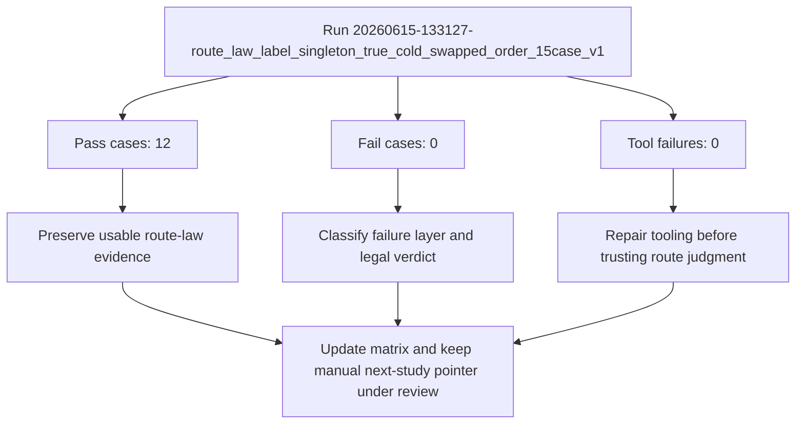

# Casework Review: route_law_label_singleton_true_cold_swapped_order_15case_v1

- **Run ID**: `20260615-133127-route_law_label_singleton_true_cold_swapped_order_15case_v1`
- **Imported At**: 2026-06-15T19:31:00.208Z
- **Raw Result JSON**: `study/raw/2026-06-15/route_law_label_singleton_true_cold_swapped_order_15case_v1__20260615-133127-route_law_label_singleton_true_cold_swapped_order_15case_v1.json`
- **Case Count**: 15

## Reflection Checklist
- [x] Mermaid-first review generated
- [x] Most important pass identified: Case 001 label-only true cold carrier (PASS_CANDIDATE)
- [x] Most important failure identified: Route id only negative after label block (HOLD_NEEDS_REVIEW)
- [x] Tool vs scorer vs language vs transport layer summarized deterministically
- [x] Evidence usability noted: This run is usable evidence because it records route-law survival behavior.
- [x] Study status change remains gated by reflection and matrix review
- [ ] Human review may still refine the generated interpretation

## Mermaid-first Review

## Classification Summary
- **PASS_CANDIDATE**: 12
- **HOLD_NEEDS_REVIEW**: 3

## Key Findings
- Most important pass: Case 001 label-only true cold carrier (PASS_CANDIDATE).
- Most important failure: Route id only negative after label block (HOLD_NEEDS_REVIEW).
- Evidence usability: This run is usable evidence because it records route-law survival behavior.

## Layer Classification
- Tool: No dominant tool failure pattern was recorded in this run.
- Scorer: No obvious scorer dispute dominates beyond the recorded classifications.
- Language: No route-law failure dominated the generated classifications.
- Transport: Transport was not the dominant issue in this run.

## Legal-system Interpretation
- Committed state is law.
- Logs and visible DOM text are admissible evidence.
- Assistant prose is a claim, not state.
- If evidence is ambiguous, HOLD and choose the smallest legal reduction.
- PASS/FAIL describes route survival, not wording perfection.

## Next Study Implication
Keep the manual next-study pointer unchanged unless the reviewed matrix shows a stronger next-study need.

## Artifact Paths
- Raw evidence: `study/raw/2026-06-15/route_law_label_singleton_true_cold_swapped_order_15case_v1__20260615-133127-route_law_label_singleton_true_cold_swapped_order_15case_v1.json`
- Review: `study/reviews/2026-06-15/route_law_label_singleton_true_cold_swapped_order_15case_v1__20260615-133127-route_law_label_singleton_true_cold_swapped_order_15case_v1.md`
- Reflection loop: `study/CASEWORK_REFLECTION_LOOP_V1.md`
- Case-law matrix: `study/case-law/CASEWORK_CASE_LAW_MATRIX_V1.md`

> Note: Human/LLM review may refine the language lesson. Update the classification in the index if the heuristic/scorer was wrong.